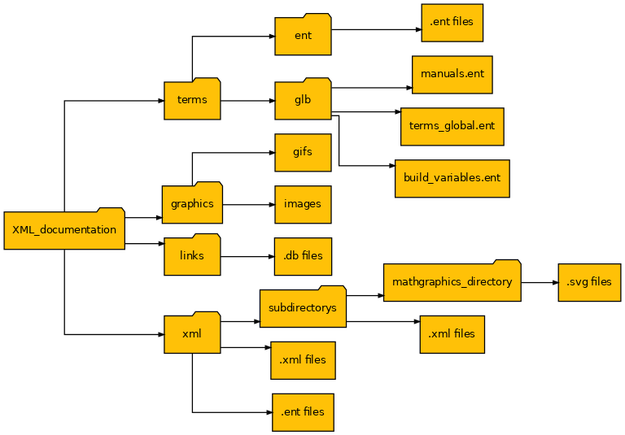
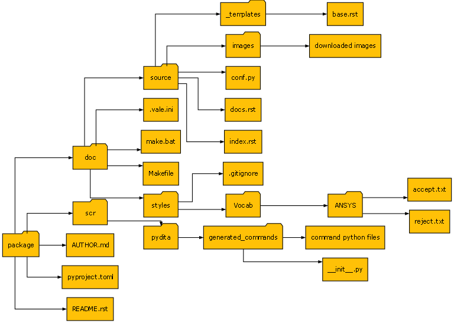

PyConverter-XML2Py
==================

A Python wrapper to convert XML documentation into Python source code
with its related Sphinx documentation.

|pyansys| |pypi| |GH-CI| |codecov| |MIT| |black|

.. |pyansys| image:: https://img.shields.io/badge/Py-Ansys-ffc107.svg?logo=data:image/png;base64,iVBORw0KGgoAAAANSUhEUgAAABAAAAAQCAIAAACQkWg2AAABDklEQVQ4jWNgoDfg5mD8vE7q/3bpVyskbW0sMRUwofHD7Dh5OBkZGBgW7/3W2tZpa2tLQEOyOzeEsfumlK2tbVpaGj4N6jIs1lpsDAwMJ278sveMY2BgCA0NFRISwqkhyQ1q/Nyd3zg4OBgYGNjZ2ePi4rB5loGBhZnhxTLJ/9ulv26Q4uVk1NXV/f///////69du4Zdg78lx//t0v+3S88rFISInD59GqIH2esIJ8G9O2/XVwhjzpw5EAam1xkkBJn/bJX+v1365hxxuCAfH9+3b9/+////48cPuNehNsS7cDEzMTAwMMzb+Q2u4dOnT2vWrMHu9ZtzxP9vl/69RVpCkBlZ3N7enoDXBwEAAA+YYitOilMVAAAAAElFTkSuQmCC
   :target: https://docs.pyansys.com/
   :alt: PyAnsys

.. |pypi| image:: https://img.shields.io/pypi/v/pyconverter-xml2py.svg?logo=python&logoColor=white
   :target: https://pypi.org/project/pyconverter-xml2py/

.. |codecov| image:: https://codecov.io/gh/ansys/pyconverter-xml2py/branch/main/graph/badge.svg
   :target: https://codecov.io/gh/ansys/pyconverter-xml2py

.. |GH-CI| image:: https://github.com/ansys/pyconverter-xml2py/actions/workflows/ci_cd.yml/badge.svg
   :target: https://github.com/ansys/pyconverter-xml2py/actions/workflows/ci_cd.yml

.. |MIT| image:: https://img.shields.io/badge/License-MIT-yellow.svg
   :target: https://opensource.org/licenses/MIT

.. |black| image:: https://img.shields.io/badge/code%20style-black-000000.svg?style=flat
  :target: https://github.com/psf/black
  :alt: black

Overview
--------

The PyConverter-XML2Py project aims to automatically generate a Python library and a related 
Sphinx documentation from an XML documentation.

Documentation and issues
------------------------

On the `PyConverter-XML2Py Issues <https://github.com/ansys/pyconverter-xml2py/issues>`_ for this repository,
you can create issues to submit questions, report bugs, and request new features. 
To reach the PyAnsys support team, email `pyansys.core@ansys.com <pyansys.core@ansys.com>`_.

Getting started
---------------

Install the ``pyconverter-xml2py`` package with:

.. code:: bash

    python -m pip install pyconverter-xml2py

It is recommended to organize the XML documentation as follow:

Converting an XML-directory
---------------------------

Once the ``XML_directory`` is correctly organized, the converter can be run.

.. code:: bash

    pyconverter-xml2py package -x XML_directory_path

If some functions need to be customized, the path containing the python 
files can be specified.

.. code:: bash

    pyconverter-xml2py package -x XML_directory_path -f customized_function_directory_path

A new package is then automatically generated. Its default name is ``package``.
It is organized as follow:

   
Then, the Sphinx documentation can be generated from this package.
The following code is to render the documentation as an HTML one from Windows:

.. code:: bash

    cd package
    pip install -e .[doc,tests] # Using a virtual environment is recommended.
    .\doc\make.bat html 
   
