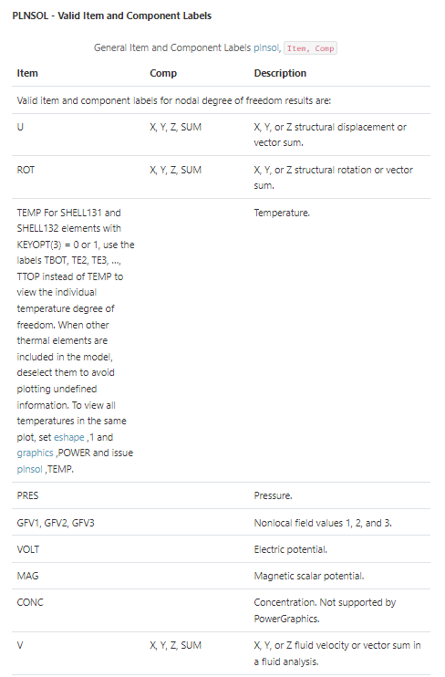

XML objects
===========

This section presents usual objects handled by the converter. It is not
an exhaustive list. For further details, please refer to the :ref:`ref_api`.

Images
------

Images are copied from the given image path to ``package/doc/source/images/``. 
The images are then included in the RST files with the following command:

.. code:: bash

    .. image:: image_path

Please note that the images present in the ``Parameters`` section don't correctly
render. This is due to an incompatibility with Python docstring.

Tables
------

The tables are accepted in the documentation. They do not need to have
a specific format as the converter uses `flat-tables <flat_tables_>`_.

    
    Table example

Links
-----

Internal and external links are both accepted.
