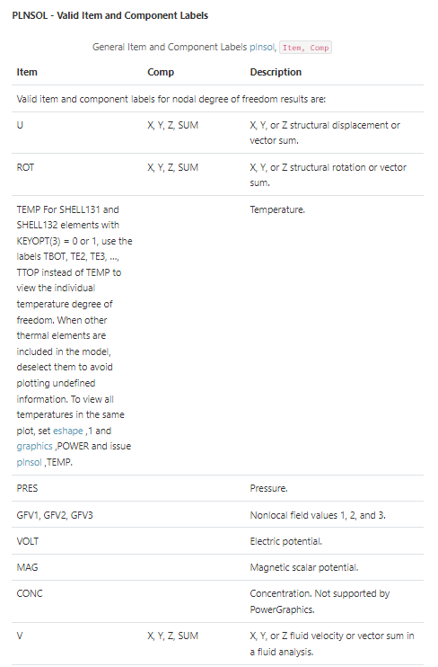

XML objects
===========

This section describes common objects handled by the converter. It is not
an exhaustive list. For more information, see the API reference section.

Images
------

Images are copied from the given image path to ``package/doc/source/images/``. 
The images are then included in the ReStructured Text (RST) files with this
command:

.. code:: bash

    .. image:: image_path

.. note::
   Images present in the ``Parameters`` section do not render correctly.
   This is due to an incompatibility with Python docstrings.

Tables
------

Tables render correctly in the documentation. They do not need to have
a specific format because the converter uses `flat-tables <flat_tables_>`_.

    
    Table example

Links
-----

Internal and external links both render correctly.
